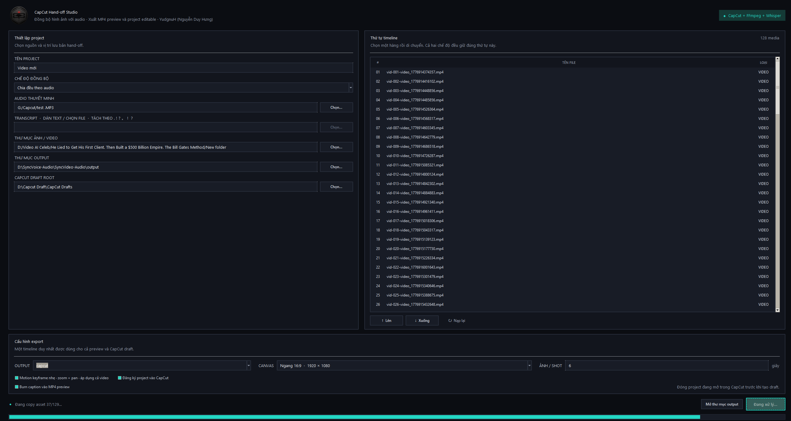
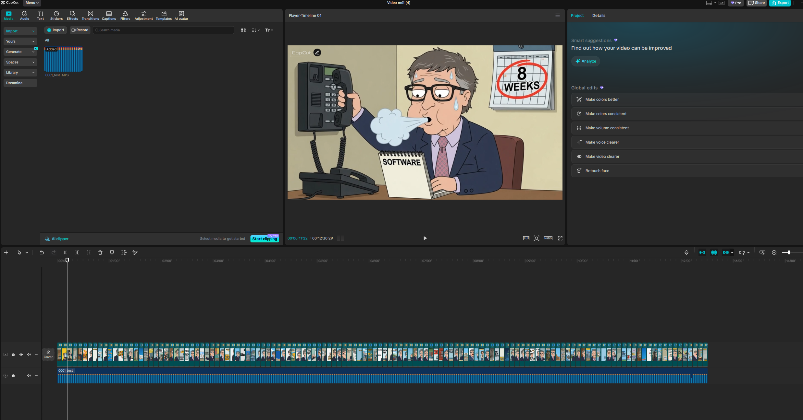

# SyncVideo-Audio

[](https://www.microsoft.com/windows)
[](https://www.python.org/)
[](LICENSE)

<p align="center">
  
</p>

<p align="center"><strong>CapCut Hand-off Studio</strong><br>
Create an ordered video timeline from narration, then continue editing in CapCut.</p>

Local-first Windows tool for turning an ordered set of images/videos and a narration track into:

- a preview MP4;
- an editable CapCut Desktop native draft;
- a JSON timeline manifest that can be exported again after manual edits.

The project is designed for predictable hand-off: media order is explicit, transcript sentences are matched by order, and no image or video semantic analysis is performed.

> **Status:** beta. CapCut's draft format is private and undocumented. The exporter currently targets the schema observed in CapCut International 9.1.0.

## Screenshots

<table>
  <tr>
    <td align="center"><strong>SyncVideo-Audio GUI</strong></td>
    <td align="center"><strong>CapCut native draft</strong></td>
  </tr>
  <tr>
    <td></td>
    <td></td>
  </tr>
</table>

## Features

- Equal-duration synchronization or transcript-guided timestamp alignment.
- Sentence splitting by punctuation, not by line breaks. Latin punctuation and CJK punctuation (`。`, `！`, `？`, `｡`, `．`, `…`) are supported.
- Local `faster-whisper` transcription with Vietnamese, Japanese, Korean, Chinese and other Whisper languages.
- Optional hard-burn captions in the MP4 preview with bundled Noto Sans CJK font support.
- Gentle zoom/pan motion with CapCut keyframes for images and videos.
- Automatic project-name collision handling: `Project`, `Project (2)`, `Project (3)`, …
- Determinate progress reporting for transcription, rendering, asset copy and CapCut export.
- Windows GUI with no black child-console windows.
- Atomic CapCut draft export with copied local assets and registry hand-off.
- Three output modes: `mp4`, `capcut`, and `both`.

## Synchronization modes

| Mode | Inputs | Behavior |
| --- | --- | --- |
| Equal duration | Audio + ordered media | Splits the audio duration evenly across media in numeric order. |
| Transcript | Audio + transcript + ordered media | Whisper supplies word timestamps; each transcript sentence is assigned to the next media item in order. |

The transcript mode does not analyze visual content and does not decide which image “matches” a sentence. The number of transcript sentences must equal the number of media items.

### Transcript splitting rules

Line breaks are normalized to spaces. A new scene is created only after sentence punctuation. This works for text such as:

```text
朝です。「元気ですか？」はい！
한국어 문장입니다. 다음 문장입니다!
早晨开始了。鸟儿在歌唱！
```

Supported input formats are `.txt`, `.srt`, and `.json`. JSON may contain `text` or `sourceText` scene fields.

## Captions and CapCut drafts

The planner stores captions and their time ranges in `*.timeline.json`. When **Burn caption vào MP4 preview** is enabled, FFmpeg renders those captions permanently into the preview video using ASS subtitles and the bundled CJK font.

The native CapCut draft currently contains the visual/audio timeline, motion keyframes, and copied assets. It does not automatically create a native CapCut text track yet; use the manifest timings or the burned preview as the caption reference when continuing the edit in CapCut.

## Requirements

For development:

- Windows 10/11;
- Python 3.10 or newer;
- FFmpeg and FFprobe available on `PATH`;
- CapCut Desktop is required only for opening/registering native drafts;
- `faster-whisper` is required for transcript mode.

The customer installer bundles Python runtime, FFmpeg/FFprobe, the `small` Whisper model and Noto Sans CJK. Customers do not need to install these separately.

## Installation for customers

Download the latest Windows installer from the [Releases](https://github.com/yudgunH/SyncVideo-Audio/releases) page:

1. Run `SyncVideo-Audio-Setup-<version>.exe`.
2. Keep the default installation directory or choose another one.
3. Launch **SyncVideo-Audio** from the Start menu or desktop shortcut.
4. Install CapCut Desktop separately if native draft registration is required.

The installer includes the application runtime, FFmpeg/FFprobe, Whisper `small` model and CJK font. No Python installation or terminal command is required for normal customer use.

## Install for development

```powershell
git clone https://github.com/yudgunH/SyncVideo-Audio.git
cd SyncVideo-Audio
python -m venv .venv
.\.venv\Scripts\Activate.ps1
python -m pip install --upgrade pip
python -m pip install -e ".[transcribe,dev]"
```

## Run the GUI

```powershell
syncvideo-audio-gui
```

Typical workflow:

1. Choose the narration audio and the image/video directory.
2. Confirm the numeric media order and adjust it with **Lên/Xuống** if needed.
3. Select `Equal duration` or `Transcript` mode.
4. Enable caption burn-in if an MP4 with permanent captions is required.
5. Choose `both` to create both the preview and the CapCut draft.
6. Close the currently open CapCut project before registering a new draft.

## CLI examples

Equal-duration mode:

```powershell
syncvideo-audio build `
  --audio "D:\Job\voice.wav" `
  --media-dir "D:\Job\media" `
  --name "Video 001" `
  --mode both `
  --output-dir "D:\Job\output"
```

Transcript-guided mode:

```powershell
syncvideo-audio build `
  --audio "D:\Job\voice.wav" `
  --media-dir "D:\Job\media" `
  --name "Video 001" `
  --sync-mode transcript `
  --transcript "D:\Job\voice.txt" `
  --whisper-model small `
  --language vi `
  --mode both `
  --output-dir "D:\Job\output"
```

Useful options include `--draft-root`, `--mapping`, `--width`, `--height`, `--fps`, `--no-motion`, `--no-register`, and `--overwrite-mp4`. The GUI burn-in option is intentionally separate from the CLI so existing manifest/export workflows remain compatible.

## Output layout

`both` mode produces a hand-off manifest and preview:

```text
output/
├── Video 001.timeline.json
└── Video 001.mp4

CapCut Drafts/
└── Video 001/
    ├── draft_content.json
    ├── draft_meta_info.json
    ├── timeline_layout.json
    ├── Timelines/
    └── Resources/syncvideo_media/
```

When a name already exists, the next available suffix is used instead of overwriting the earlier hand-off.

## Build Windows artifacts

### Development EXE

This build expects FFmpeg and FFprobe on `PATH` and is useful for local testing:

```powershell
python -m pip install pyinstaller
powershell -ExecutionPolicy Bypass -File .\packaging\build_windows.ps1
```

The result is written to `dist/`.

### Full customer installer

The full build is an onedir payload followed by Inno Setup packaging:

```powershell
python -m pip install pyinstaller
powershell -ExecutionPolicy Bypass -File .\packaging\build_full.ps1
```

The full build expects these local assets:

```text
assets/fonts/NotoSansCJK-Regular.ttc
assets/models/small/
assets/tools/ffmpeg.exe
assets/tools/ffprobe.exe
```

The generated files are:

- `dist-full/SyncVideo-Audio/` — portable onedir payload;
- `dist-installer/SyncVideo-Audio-Setup-0.1.0.exe` — customer installer.

The large model and executable assets are intentionally ignored by Git. Keep them in the release/build environment and publish checksums for downloadable binaries.

## Release checklist

Before publishing a GitHub release:

1. Run `python -m pytest` and `git diff --check`.
2. Build `dist-full/SyncVideo-Audio/` and smoke-test the EXE on a clean Windows account.
3. Build `dist-installer/SyncVideo-Audio-Setup-<version>.exe` with Inno Setup.
4. Create an annotated tag such as `v0.1.0` and upload the installer as a release asset.
5. Publish SHA-256 checksums for the installer and portable payload.

Release notes should state the supported CapCut version, included Whisper model, FFmpeg build/license configuration and any known schema limitations.

## Development

```powershell
python -m pip install -e ".[dev]"
python -m pytest
python -m compileall -q src packaging
```

The code is split into small adapters:

- `planner.py` — media ordering, equal/transcript alignment and caption ranges;
- `transcription.py` — sentence parsing and Whisper backends;
- `ffmpeg_renderer.py` — MP4 rendering, motion filters and caption burn-in;
- `capcut_schema.py` / `capcut_exporter.py` — native draft structure and asset hand-off;
- `pipeline.py` — output collision handling and orchestration;
- `gui.py` — Windows GUI;
- `packaging/` — PyInstaller and Inno Setup definitions.

## Privacy and safety

Processing is local by default. Audio, transcripts and media are not uploaded by this project. Whisper model downloads or CapCut behavior may still involve third-party software when explicitly configured by the user.

Never overwrite a draft that is open in CapCut. Keep the `*.timeline.json` manifest and original media so a hand-off can be reproduced after a CapCut schema change.

## Known limitations

- CapCut's native schema is undocumented and may change between versions.
- Transcript alignment is order-based; it is not semantic image/video matching.
- Native CapCut text-track generation is not implemented yet.
- The full installer is Windows-only.

## Contributing

Issues and pull requests are welcome. Please include:

- Windows and CapCut versions;
- synchronization mode;
- a minimal transcript/media example when possible;
- the generated error message or test reproduction.

Avoid committing personal media, audio, Whisper caches, generated drafts, or the large binary release payload.

## License and third-party components

The project-owned source code and logo assets are released under the [MIT License](LICENSE). Bundled third-party components retain their own licenses; see [THIRD_PARTY_NOTICES.md](THIRD_PARTY_NOTICES.md).

Author: **YudgnuH (Nguyễn Duy Hưng)**

## Tóm tắt tiếng Việt

SyncVideo-Audio là công cụ Windows tạo preview MP4 và project CapCut native từ audio thuyết minh cùng danh sách ảnh/video có thứ tự. Có hai chế độ: chia đều thời lượng hoặc căn timestamp bằng transcript + Whisper. Caption có thể burn cố định vào MP4; draft CapCut hiện chưa tự tạo text track native. Dự án dùng MIT License cho code và logo, còn FFmpeg/model/font tuân theo license riêng được ghi trong [THIRD_PARTY_NOTICES.md](THIRD_PARTY_NOTICES.md).
